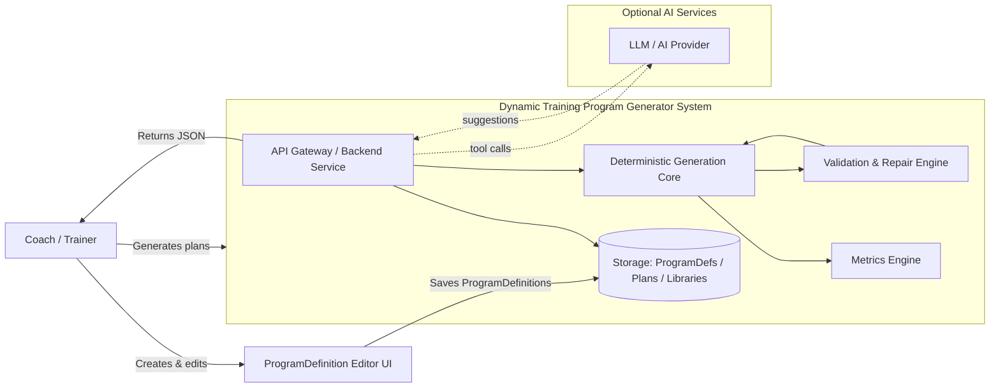
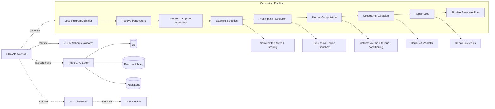

# Architecture — C4 (Mermaid)

Date: 2026-02-23

This document provides **C4-style** diagrams for the Dynamic Training Program Generator.
All diagrams are expressed in Mermaid so they render nicely in GitHub / GitLab / Markdown viewers that support Mermaid.

> If your repo viewer does not support Mermaid, you can still use these as source-of-truth and export via a doc tool later.

---

## C1 — System Context



---

## C2 — Container Diagram

```mermaid
flowchart TB
  subgraph Frontend[Frontend]
    UI[Coach UI (Web/Mobile)]
    DEFUI[ProgramDefinition Editor]
    PLANUI[Plan Viewer / Renderer]
    ANALYTICSUI[Analytics Dashboard]
  end

  subgraph Backend[Backend]
    BFF[Plan API Service (REST/GraphQL)]
    SCHEMA[Schema Validator (JSON Schema)]
    EXPR[Expression Engine (Sandbox)]
    SELECT[Exercise Selector]
    GEN[Plan Generator]
    METRICS[Metrics Engine]
    VALIDATE[Validation Engine]
    REPAIR[Repair Engine]
    AIA[AI Orchestrator (Optional)]
  end

  subgraph Data[Data Layer]
    DB[(DB: ProgramDefs, Plans)]
    LIB[(Exercise Library JSON)]
    LOG[(Audit Logs)]
  end

  UI --> BFF
  DEFUI --> BFF
  PLANUI --> BFF
  ANALYTICSUI --> BFF

  BFF --> SCHEMA
  BFF --> GEN
  GEN --> EXPR
  GEN --> SELECT
  GEN --> METRICS
  GEN --> VALIDATE
  VALIDATE --> REPAIR
  REPAIR --> GEN

  BFF --> DB
  BFF --> LIB
  GEN --> LOG

  BFF -. optional .-> AIA
  AIA -. tool calls .-> LLM[LLM Provider]
```

---

## C3 — Component Diagram (Backend Service)



---

## Notes & Responsibilities

- **Deterministic core** is always authoritative.
- **AI** (if enabled) can only propose JSON artifacts (definitions, accessory candidates, lint findings).
- **Schema validation** is required at every boundary (inputs, AI outputs, stored artifacts).
- **Expression engine** must be sandboxed (no IO, no imports, no OS access).
