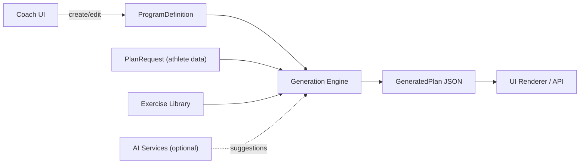
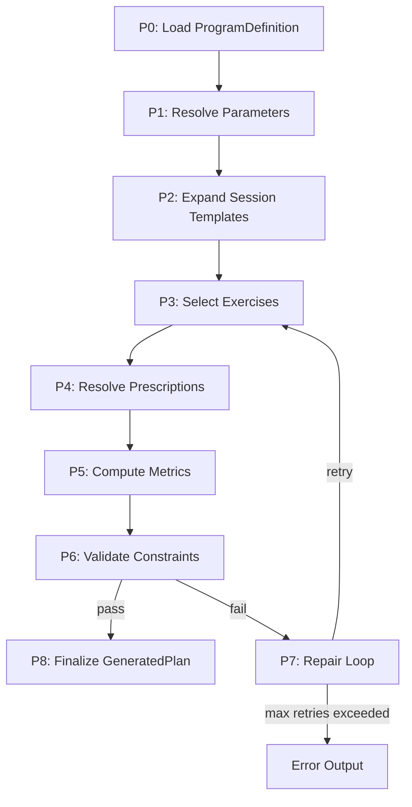
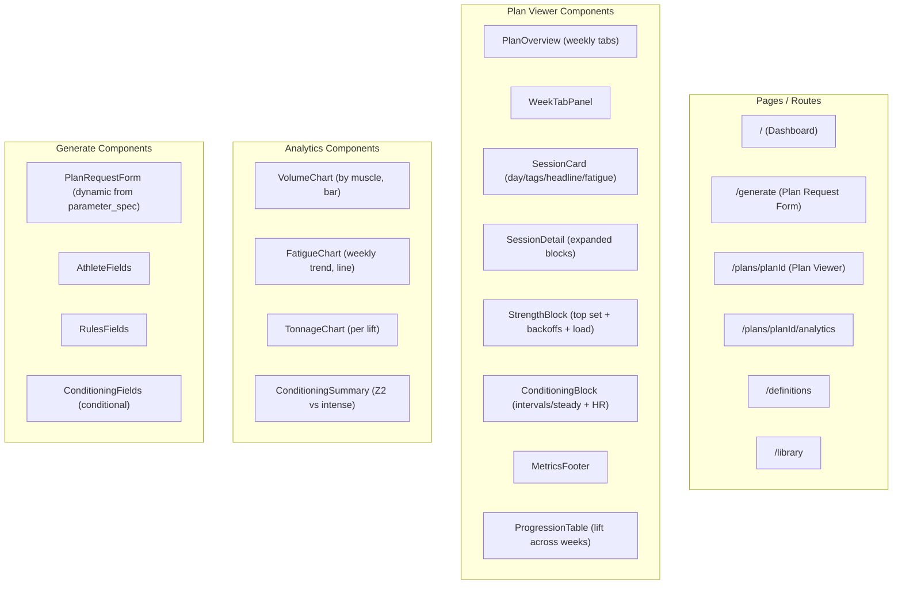

# Dynamic Training Program Generator -- Design & Architecture

> This document is the single source of truth for the system design.
> Last updated: 2026-02-23

---

## 1. System Overview

A "Programs-as-Code" system where coaches define ProgramDefinitions and a deterministic engine generates multi-week training plans (strength + conditioning) from PlanRequests.



**Core invariant**: The deterministic engine is always authoritative. AI is advisory only.

---

## 2. Technology Stack

### Backend

- **Runtime**: Python 3.12+
- **Framework**: FastAPI (latest) with Uvicorn
- **Validation**: Pydantic v2 (models from JSON Schema Draft 2020-12)
- **Testing**: pytest 8+ with pytest-cov, pytest-asyncio, hypothesis (property-based), syrupy (snapshot testing)
- **Linting/Formatting**: Ruff (linter + formatter, replaces flake8/black/isort)
- **Type Checking**: mypy (strict mode)
- **Package Manager**: uv (fast Python package manager, replaces pip/poetry)
- **Task Runner**: Makefile

### Frontend

- **Framework**: Next.js 15 (App Router) with React 19 and TypeScript 5.x (strict mode)
- **Styling**: Tailwind CSS v4 + shadcn/ui components
- **Charts**: Recharts (for analytics dashboards)
- **State Management**: TanStack Query v5 (server state), Zustand (client state)
- **Forms**: React Hook Form + Zod validation
- **Testing**: Vitest + React Testing Library (unit/component), Playwright (E2E)
- **Linting**: ESLint (flat config) + Prettier
- **Package Manager**: pnpm

### Infrastructure

- **Containerization**: Docker + Docker Compose (backend + frontend + db)
- **Database**: PostgreSQL 16 with JSONB (Phase 2; MVP uses file-based JSON)
- **CI**: GitHub Actions (lint, type-check, test, build on every PR)
- **Monorepo**: Turborepo (orchestrates backend + frontend tasks)

---

## 3. Complete Project Structure

```
training-program-generator/
|
|-- .cursor/
|   |-- rules                  # Cursor AI rules file (best practices)
|
|-- .github/
|   |-- workflows/
|       |-- ci.yml             # Lint + type-check + test + build
|
|-- apps/
|   |-- backend/                      # Python FastAPI backend
|   |   |-- pyproject.toml            # uv project config
|   |   |-- uv.lock
|   |   |-- Dockerfile
|   |   |-- Makefile                  # Task definitions
|   |   |
|   |   |-- src/
|   |   |   |-- __init__.py
|   |   |   |-- main.py               # FastAPI app factory, startup, CORS
|   |   |   |-- config.py             # Environment-based settings (pydantic-settings)
|   |   |   |
|   |   |   |-- api/
|   |   |   |   |-- __init__.py
|   |   |   |   |-- router.py         # Main API router aggregator
|   |   |   |   |-- dependencies.py   # Dependency injection (library, definitions)
|   |   |   |   |-- errors.py         # Structured error responses
|   |   |   |   |-- routes/
|   |   |   |       |-- __init__.py
|   |   |   |       |-- generate.py       # POST /generate
|   |   |   |       |-- definitions.py    # GET /program-definitions
|   |   |   |       |-- library.py        # GET /exercise-library
|   |   |   |       |-- validate.py       # POST /validate-definition
|   |   |   |       |-- health.py         # GET /health
|   |   |   |
|   |   |   |-- models/
|   |   |   |   |-- __init__.py
|   |   |   |   |-- exercise_library.py   # ExerciseLibrary, Exercise
|   |   |   |   |-- program_definition.py # ProgramDefinition, ParameterSpec, Template
|   |   |   |   |-- plan_request.py       # PlanRequest, Athlete
|   |   |   |   |-- generated_plan.py     # GeneratedPlan, Week, Session, Block
|   |   |   |   |-- enums.py             # Pattern, Muscle, Level, Method enums
|   |   |   |   |-- errors.py            # Error model (type, message, details)
|   |   |   |
|   |   |   |-- core/
|   |   |   |   |-- __init__.py
|   |   |   |   |-- pipeline.py           # 8-stage generation orchestrator
|   |   |   |   |-- context.py            # GenerationContext (ctx object builder)
|   |   |   |   |
|   |   |   |   |-- expression/
|   |   |   |   |   |-- __init__.py
|   |   |   |   |   |-- lexer.py          # Tokenizer
|   |   |   |   |   |-- parser.py         # Recursive-descent parser -> AST
|   |   |   |   |   |-- evaluator.py      # AST evaluator with sandboxed context
|   |   |   |   |   |-- ast_nodes.py      # AST node types
|   |   |   |   |   |-- functions.py      # Built-in functions (choose, min, max, clamp, round)
|   |   |   |   |   |-- exceptions.py     # Expression-specific errors
|   |   |   |   |
|   |   |   |   |-- selector/
|   |   |   |   |   |-- __init__.py
|   |   |   |   |   |-- exercise_selector.py  # Tag filtering, scoring, dedup
|   |   |   |   |
|   |   |   |   |-- prescription/
|   |   |   |   |   |-- __init__.py
|   |   |   |   |   |-- resolver.py           # Dispatch by prescription mode
|   |   |   |   |   |-- strength.py           # top_set_plus_backoff, reps_range_rir
|   |   |   |   |   |-- conditioning.py       # steady_state, intervals
|   |   |   |   |   |-- load_calculator.py    # RPE tables, e1rm -> load, rounding
|   |   |   |   |   |-- intensity_resolver.py # Zone functions -> HR/pace/power/RPE
|   |   |   |   |
|   |   |   |   |-- metrics/
|   |   |   |   |   |-- __init__.py
|   |   |   |   |   |-- fatigue.py         # Per-set, per-session, per-week fatigue
|   |   |   |   |   |-- volume.py          # Hard sets weighted, tonnage
|   |   |   |   |   |-- conditioning.py    # Z2 minutes, intense minutes
|   |   |   |   |
|   |   |   |   |-- validation/
|   |   |   |   |   |-- __init__.py
|   |   |   |   |   |-- validator.py       # Hard + soft constraint checking
|   |   |   |   |   |-- constraints.py     # Constraint definitions
|   |   |   |   |
|   |   |   |   |-- repair/
|   |   |   |       |-- __init__.py
|   |   |   |       |-- engine.py          # Repair loop orchestrator
|   |   |   |       |-- strategies.py      # Individual repair strategies
|   |   |   |
|   |   |   |-- data/
|   |   |   |   |-- __init__.py
|   |   |   |   |-- loader.py             # Load exercise library + definitions
|   |   |   |   |-- repository.py         # Abstract repo + file-based impl
|   |   |   |
|   |   |   |-- ai/                        # Optional, Phase 2
|   |   |       |-- __init__.py
|   |   |       |-- orchestrator.py
|   |   |       |-- tools.py
|   |   |
|   |   |-- tests/
|   |       |-- __init__.py
|   |       |-- conftest.py                # Shared fixtures
|   |       |-- unit/
|   |       |   |-- test_expression_lexer.py
|   |       |   |-- test_expression_parser.py
|   |       |   |-- test_expression_evaluator.py
|   |       |   |-- test_exercise_selector.py
|   |       |   |-- test_load_calculator.py
|   |       |   |-- test_intensity_resolver.py
|   |       |   |-- test_prescription_strength.py
|   |       |   |-- test_prescription_conditioning.py
|   |       |   |-- test_metrics_fatigue.py
|   |       |   |-- test_metrics_volume.py
|   |       |   |-- test_metrics_conditioning.py
|   |       |   |-- test_validator.py
|   |       |   |-- test_repair_strategies.py
|   |       |   |-- test_models.py
|   |       |-- integration/
|   |       |   |-- test_pipeline_strength.py
|   |       |   |-- test_pipeline_conditioning.py
|   |       |   |-- test_pipeline_edge_cases.py
|   |       |-- snapshot/
|   |       |   |-- test_strength_snapshot.py
|   |       |   |-- test_conditioning_snapshot.py
|   |       |   |-- __snapshots__/
|   |       |-- api/
|   |       |   |-- test_generate_endpoint.py
|   |       |   |-- test_definitions_endpoint.py
|   |       |   |-- test_library_endpoint.py
|   |       |   |-- test_error_responses.py
|   |       |-- property/
|   |           |-- test_plan_invariants.py
|   |           |-- test_expression_safety.py
|   |
|   |-- frontend/                        # Next.js frontend
|       |-- package.json
|       |-- pnpm-lock.yaml
|       |-- next.config.ts
|       |-- tsconfig.json
|       |-- tailwind.config.ts
|       |-- postcss.config.ts
|       |-- Dockerfile
|       |-- vitest.config.ts
|       |-- playwright.config.ts
|       |-- .env.local.example
|       |
|       |-- src/
|       |   |-- app/
|       |   |   |-- layout.tsx            # Root layout
|       |   |   |-- page.tsx              # Home / dashboard
|       |   |   |-- globals.css           # Tailwind base
|       |   |   |-- generate/
|       |   |   |   |-- page.tsx          # Plan generation form
|       |   |   |   |-- loading.tsx
|       |   |   |-- plans/
|       |   |   |   |-- page.tsx          # Plans list
|       |   |   |   |-- [planId]/
|       |   |   |       |-- page.tsx      # Plan viewer
|       |   |   |       |-- analytics/
|       |   |   |           |-- page.tsx  # Analytics dashboard
|       |   |   |-- definitions/
|       |   |   |   |-- page.tsx          # Definitions list
|       |   |   |   |-- [defId]/
|       |   |   |       |-- page.tsx      # Definition viewer
|       |   |   |-- library/
|       |   |       |-- page.tsx          # Exercise library browser
|       |   |
|       |   |-- components/
|       |   |   |-- ui/                    # shadcn/ui primitives
|       |   |   |-- plan/
|       |   |   |   |-- PlanOverview.tsx
|       |   |   |   |-- WeekTabPanel.tsx
|       |   |   |   |-- SessionCard.tsx
|       |   |   |   |-- SessionDetail.tsx
|       |   |   |   |-- BlockRow.tsx
|       |   |   |   |-- StrengthBlock.tsx
|       |   |   |   |-- ConditioningBlock.tsx
|       |   |   |   |-- MetricsFooter.tsx
|       |   |   |   |-- WarningBanner.tsx
|       |   |   |   |-- ProgressionTable.tsx
|       |   |   |-- analytics/
|       |   |   |   |-- VolumeChart.tsx
|       |   |   |   |-- FatigueChart.tsx
|       |   |   |   |-- TonnageChart.tsx
|       |   |   |   |-- ConditioningSummary.tsx
|       |   |   |   |-- IntensityDistribution.tsx
|       |   |   |-- generate/
|       |   |   |   |-- PlanRequestForm.tsx
|       |   |   |   |-- AthleteFields.tsx
|       |   |   |   |-- RulesFields.tsx
|       |   |   |   |-- ConditioningFields.tsx
|       |   |   |-- library/
|       |   |   |   |-- ExerciseTable.tsx
|       |   |   |   |-- ExerciseDetail.tsx
|       |   |   |   |-- MuscleMap.tsx
|       |   |   |-- layout/
|       |   |       |-- Navbar.tsx
|       |   |       |-- Sidebar.tsx
|       |   |       |-- PageHeader.tsx
|       |   |       |-- Footer.tsx
|       |   |
|       |   |-- lib/
|       |   |   |-- api-client.ts
|       |   |   |-- types.ts
|       |   |   |-- utils.ts
|       |   |   |-- constants.ts
|       |   |
|       |   |-- hooks/
|       |   |   |-- use-generate-plan.ts
|       |   |   |-- use-plan.ts
|       |   |   |-- use-definitions.ts
|       |   |   |-- use-library.ts
|       |   |
|       |   |-- stores/
|       |       |-- plan-store.ts
|       |
|       |-- tests/
|           |-- components/
|           |   |-- plan/
|           |   |   |-- PlanOverview.test.tsx
|           |   |   |-- SessionCard.test.tsx
|           |   |   |-- BlockRow.test.tsx
|           |   |-- analytics/
|           |   |   |-- VolumeChart.test.tsx
|           |   |   |-- FatigueChart.test.tsx
|           |   |-- generate/
|           |       |-- PlanRequestForm.test.tsx
|           |-- hooks/
|           |   |-- use-generate-plan.test.ts
|           |-- lib/
|           |   |-- api-client.test.ts
|           |   |-- utils.test.ts
|           |-- e2e/
|               |-- generate-plan.spec.ts
|               |-- view-plan.spec.ts
|               |-- analytics.spec.ts
|
|-- docs/
|   |-- dynamic-training-program-generator.md
|   |-- stakeholder_proposal.md
|   |-- architecture_c4.md
|   |-- design_and_architecture.md       # THIS FILE
|   |-- TODO.md                          # Trackable checklist
|
|-- schemas/
|   |-- exercise_library.schema.json
|   |-- program_definition.schema.json
|   |-- plan_request.schema.json
|   |-- generated_plan.schema.json
|
|-- definitions/
|   |-- strength_ul_4w_v1.json
|   |-- conditioning_4w_v1.json
|
|-- data/
|   |-- exercise_library_v1.json
|
|-- examples/
|   |-- strength_plan_request.json
|   |-- strength_generated_plan.json
|   |-- conditioning_plan_request.json
|   |-- conditioning_generated_plan.json
|
|-- openapi/
|   |-- openapi.yaml
|
|-- docker-compose.yml
|-- turbo.json
|-- package.json
|-- .gitignore
|-- .env.example
|-- README.md
```

---

## 4. Cursor Rules

The `.cursor/rules` file defines coding standards for AI-assisted development:

- **TDD mandatory**: Write failing tests first, then implement, then refactor. Never skip tests.
- **Type safety**: Python strict mypy, TypeScript strict mode. No `any` types.
- **Schema-first**: All data structures derive from JSON Schemas in `schemas/`. Pydantic models are Python source of truth; TypeScript types mirror them.
- **Determinism**: The generation engine must produce identical output for identical inputs. Use `seed` for controlled randomness.
- **Immutability**: Prefer immutable data structures. Pipeline stages receive read-only context, return new objects.
- **Error handling**: Use structured error types, never bare exceptions. Every error path must be tested.
- **No narrating comments**: Comments only for non-obvious intent, trade-offs, or domain formulas.
- **Single responsibility**: Each module/file does one thing. Pipeline stages are independently testable.
- **Run tests before committing**: All tests must pass. Coverage >= 90%.

---

## 5. Environment Configuration (Step-by-Step)

### 5.1 Prerequisites

- Python 3.12+ (via pyenv or system)
- Node.js 20+ LTS (via nvm or fnm)
- pnpm 9+ (`corepack enable && corepack prepare pnpm@latest`)
- uv (`curl -LsSf https://astral.sh/uv/install.sh | sh`)
- Docker + Docker Compose
- Git

### 5.2 Monorepo Initialization

- `package.json` at root with `"workspaces"` pointing to `apps/*`
- `turbo.json` defining pipeline: `lint`, `typecheck`, `test`, `build`, `dev`
- `.gitignore` covering Python (`__pycache__`, `.venv`, `.mypy_cache`), Node (`node_modules`, `.next`), env files

### 5.3 Backend Setup (`apps/backend/`)

- `uv init` -> `pyproject.toml` with:
  - Dependencies: `fastapi`, `uvicorn[standard]`, `pydantic>=2.0`, `pydantic-settings`, `jsonschema`
  - Dev dependencies: `pytest`, `pytest-cov`, `pytest-asyncio`, `httpx`, `hypothesis`, `syrupy`, `ruff`, `mypy`
  - `[tool.ruff]`: line-length=100, select=["E","F","I","UP","B","SIM","TCH"], target-version="py312"
  - `[tool.mypy]`: strict=true, plugins=["pydantic.mypy"]
  - `[tool.pytest.ini_options]`: testpaths=["tests"], asyncio_mode="auto", addopts="--cov=src --cov-report=term-missing --cov-fail-under=90"

### 5.4 Frontend Setup (`apps/frontend/`)

- `pnpm create next-app@latest` with App Router, TypeScript, Tailwind, ESLint
- Add: `shadcn/ui`, `recharts`, `@tanstack/react-query`, `zustand`, `react-hook-form`, `zod`
- Dev deps: `vitest`, `@testing-library/react`, `@testing-library/jest-dom`, `@playwright/test`, `msw`
- `vitest.config.ts`: jsdom environment, coverage thresholds
- `playwright.config.ts`: baseURL from env, chromium project

### 5.5 Docker

- `apps/backend/Dockerfile`: multi-stage (uv install -> slim runtime)
- `apps/frontend/Dockerfile`: multi-stage (pnpm install -> next build -> standalone)
- `docker-compose.yml`: backend (port 8000), frontend (port 3000), shared network

### 5.6 CI (GitHub Actions)

- On push/PR: lint -> typecheck -> test (unit) -> test (integration) -> test (snapshot) -> build
- Separate jobs for backend and frontend (parallel)
- Cache: uv cache, pnpm store, Next.js build cache

---

## 6. Domain Model (Core Entities)

Derived from the four JSON Schemas in `schemas/`:

- **ExerciseLibrary** (`schemas/exercise_library.schema.json`): version, closed taxonomies (14 patterns, 17 muscles), array of Exercise objects (id, name, patterns, muscles map 0-1.5, equipment, swap_group, fatigue_cost 0-2, contraindications, tags)
- **ProgramDefinition** (`schemas/program_definition.schema.json`): program_id, version, parameter_spec (dynamic fields with `required_if`/`visible_if` expressions), exercise_library_ref, template (weeks/days/sessions/blocks), prescriptions (keyed by ref, each with mode + output_mapping expressions), rules, validation (hard/soft/repair)
- **PlanRequest** (`schemas/plan_request.schema.json`): program reference, weeks, days_per_week, athlete (level, equipment, restrictions, e1rm map, time_budget, modality), rules overrides, conditioning params, optional seed
- **GeneratedPlan** (`schemas/generated_plan.schema.json`): program reference, generated_at, inputs_echo, weeks array (sessions with blocks + metrics), warnings, repairs, plan_summary

---

## 7. Generation Pipeline Architecture

8-stage deterministic pipeline:



### P0 - Load ProgramDefinition

Fetch by program_id + version. Validate against `program_definition.schema.json`.

### P1 - Resolve Parameters

Merge PlanRequest values with ProgramDefinition `parameter_spec` defaults. Evaluate `required_if` / `visible_if` expressions. Validate all required fields present. Build the `ctx` context object used throughout.

### P2 - Expand Session Templates

For each week (1..N) and each session in `template.sessions`, create concrete session stubs. Respect `optional` flags (e.g., conditioning day 4/5 are optional, only included if `days_per_week` allows). Populate `ctx.week` and `ctx.day` for expression evaluation.

### P3 - Select Exercises

For each block in each session, run the `exercise_selector`:
- Filter exercise library by `include_tags` (must match at least one)
- Exclude by `exclude_tags` and athlete `restrictions` (contraindications)
- Filter by athlete `equipment` availability
- Score candidates by `prefer_tags` match count
- Apply `avoid_same_exercise_within_days` and `avoid_same_swap_group_within_days` rules
- Select top `count` exercises deterministically (sort by score, break ties by exercise id; use `seed` for controlled variation)

### P4 - Resolve Prescriptions

Look up `prescription_ref` from the prescriptions map. Evaluate all `output_mapping` expressions in the sandbox with the current `ctx`. This handles:
- **Strength**: `top_set_plus_backoff` mode -- compute load from e1rm using RPE/percent tables, apply rounding profile, resolve backoff sets/reps/load
- **Conditioning steady**: `steady_state` mode -- resolve duration and intensity target (e.g., `z(2)` maps to HR range via `conditioning_intensity_resolver` + Karvonen formula)
- **Conditioning intervals**: `intervals` mode -- resolve warmup, work intervals/duration, rest, cooldown, intensity target
- **Accessories**: `reps_range_rir` -- resolve sets, rep range, target RIR
- **Conditional blocks**: `conditional_block` -- evaluate `enabled_expr` before generating

### P5 - Compute Metrics

Per-session and per-week aggregation:
- **Strength fatigue**: `sum(exercise.fatigue_cost * intensity_factor * sets)` per session
- **Strength volume**: hard sets weighted by muscle activation map (e.g., 3 sets of back squat = 3 * 1.0 quads + 3 * 0.7 glutes + 3 * 0.4 erectors)
- **Tonnage**: `sets * reps * load_kg` for main lifts
- **Conditioning**: Z2 minutes (steady-state at zone 2), intense minutes (threshold + VO2 work intervals only)

### P6 - Validate Constraints

Check hard constraints from `validation.hard`:
- `max_weekly_volume_by_key` (per muscle, level-dependent: novice 16, intermediate 20, advanced 24)
- `min_weekly_volume_by_key` (per pattern, e.g., vertical_pull >= 4)
- `max_fatigue_per_session` (10) and `max_fatigue_per_week` (38)
- Conditioning: `max_intense_minutes_per_week` and `min_z2_minutes_per_week`
- Also evaluate `soft.warnings` and collect them

### P7 - Repair Loop

If hard constraints fail, apply repair strategies in defined order:
- Strength: `reduce_accessory_sets` -> `swap_to_lower_fatigue_variant` -> `reduce_backoff_sets` -> `drop_optional_blocks`
- Conditioning: `drop_optional_blocks` -> `reduce_interval_repeats`
- Respect `max_repairs_per_session` and `max_repairs_per_plan` limits
- Re-run P3-P6 after each repair. If limits exceeded, return error with details.

### P8 - Finalize

Assemble GeneratedPlan JSON with `inputs_echo`, all weeks/sessions/blocks, warnings, repairs log, and `plan_summary`.

---

## 8. Expression Engine Design

Sandboxed custom recursive-descent parser.

**Supported constructs** (from `definitions/*.json`):
- `choose(ctx.week, [5,5,3,5])` -- index-based lookup (1-indexed by week)
- `choose(ctx.athlete.level, {'novice':16, 'intermediate':20, 'advanced':24})` -- key-based lookup
- `choose(pattern, {'vertical_pull':4, 'horizontal_pull':6})` -- dynamic key
- Context variable access: `ctx.week`, `ctx.athlete.level`, `ctx.rules.accessory_rir_target`, `ctx.plan.weekly_volume.*`
- Arithmetic: `+`, `-`, `*`, `/`
- Comparisons: `==`, `!=`, `<`, `>`, `<=`, `>=`
- Boolean: `&&`, `||`, `!`
- Functions: `min()`, `max()`, `round()`, `clamp()`
- String literals: `'plate_2p5kg'`
- Zone functions: `z(1)`, `z(2)`, `thr()`, `vo2()` -- resolve to intensity targets

**Implementation approach**:
- Custom recursive-descent parser that produces an AST
- AST evaluator with a read-only context dict
- No `eval()`, no `exec()`, no filesystem/network access
- Timeout: 10ms per expression
- Whitelist of allowed functions

---

## 9. Load Calculation (Strength)

For main lifts using RPE-based prescriptions:
- Use a standard RPE-to-percentage table (Tuchscherer/RTS style)
- `load_kg = e1rm * rpe_percentage(reps, target_rpe)`
- Apply rounding profile: `plate_2p5kg` rounds to nearest 2.5kg, `db_2kg` rounds to nearest 2kg
- Backoff load: `top_set_load * backoff_load_factor` (e.g., 0.90), then round

---

## 10. Conditioning Intensity Resolution

The `conditioning_intensity_resolver` in the ProgramDefinition maps zone functions to concrete ranges per method:

- **HR_ZONES (Karvonen HRR)**:
  - `HRR = hr_max - hr_rest`
  - `hr_low = hr_rest + HRR * pct_low`, `hr_high = hr_rest + HRR * pct_high`
  - Example: z(2) with hr_max=190, hr_rest=55 => HRR=135 => [55+135*0.7, 55+135*0.8] = [150, 163] bpm
- **%HRmax**: direct percentage of hr_max
- **PACE**: multiply test pace by pace_factor range
- **POWER**: multiply FTP by ftp_pct range
- **RPE**: direct RPE range

---

## 11. API Design

- `GET /health` -- readiness check
- `GET /program-definitions` -- list available ProgramDefinitions
- `GET /program-definitions/{program_id}/{version}` -- get specific definition with resolved parameter_spec
- `POST /generate` -- accepts PlanRequest body, returns GeneratedPlan
- `GET /exercise-library/{version}` -- return exercise library
- `POST /validate-definition` -- validate a ProgramDefinition against schema + expression syntax

Structured errors:

```json
{
  "error": {
    "type": "CONSTRAINT_VIOLATION",
    "message": "Max weekly volume exceeded and repair failed",
    "details": { "muscle": "quads", "limit": 20, "actual": 26 }
  }
}
```

---

## 12. Frontend Architecture



Key UX patterns:
- **Plan Overview**: Weekly tabs, session cards per day with tags and summary
- **Session Detail**: Blocks in order with exercise, prescription, intensity, load (or load_note for accessories)
- **Analytics**: Volume heatmap by muscle, fatigue curve across weeks, conditioning intensity distribution

---

## 13. TDD Workflow & Phase Gates

Every phase follows RED-GREEN-REFACTOR:
1. **RED**: Write failing tests that define the expected behavior
2. **GREEN**: Write minimum code to pass
3. **REFACTOR**: Clean up while keeping tests green
4. **GATE**: All tests for this phase + all previous phases must pass before proceeding

Test commands (run after every change):
- Backend: `cd apps/backend && uv run pytest`
- Frontend: `cd apps/frontend && pnpm test`
- E2E: `pnpm exec playwright test`

---

## 14. AI Integration (Optional, Phase 2+)

AI tools as defined in the spec:
- `suggest_program_definition()`: Natural language -> ProgramDefinition JSON (must validate)
- `suggest_accessories()`: Propose exercise candidates for slots
- `lint_program_or_plan()`: Quality warnings (balance, variety, interference)
- `suggest_repairs()`: Propose fixes when repair loop fails

**Guardrails**: All AI output must pass JSON Schema validation before acceptance. Store suggestions + rationale in audit logs. Optional seed for reproducibility.

---

## 15. Performance Targets

- Single plan generation: < 50ms (deterministic path, no I/O during generation)
- Exercise library: loaded once at startup, cached in memory
- Expression evaluation: < 10ms per expression (with timeout enforcement)
- Frontend: < 2s initial page load (Next.js SSR/SSG)
- API response: < 100ms for /generate endpoint
